# 🔍 Supabase User Creation & Authentication Analysis

## 📋 **Current Authentication Setup**

### **1. Frontend Authentication (AuthContext.tsx)**
```typescript
// Simplified auth - automatically set admin user
const adminUser: User = {
  id: 'b58515cb-6880-482e-a78e-7872bb53e3a8', // Hardcoded admin ID
  email: 'admin@logicworks.com',
  display_name: 'Admin User',
  is_admin: true,
  created_at: new Date().toISOString()
};
```

**Key Issues:**
- ❌ **No real Supabase Auth integration** - uses hardcoded admin user
- ❌ **Bypasses actual authentication** - accepts any login as admin
- ❌ **No session management** - doesn't use Supabase sessions

### **2. Supabase Client Configuration**
```typescript
// src/integrations/supabase/client.ts
const SUPABASE_URL = "https://yipyteszzyycbqgzpfrf.supabase.co";
const SUPABASE_PUBLISHABLE_KEY = "eyJhbGciOiJIUzI1NiIsInR5cCI6IkpXVCJ9...";

export const supabase = createClient<Database>(SUPABASE_URL, SUPABASE_PUBLISHABLE_KEY);
```

**Configuration:**
- ✅ **Correct URL and publishable key**
- ❌ **Only uses publishable key** - limited to client-side operations
- ❌ **No service role key** - cannot perform admin operations

### **3. Backend API Authentication**
```javascript
// api/admin/create-user.js
const supabaseAdmin = createClient(SUPABASE_URL, SUPABASE_SERVICE_ROLE_KEY, {
  auth: {
    autoRefreshToken: false,
    persistSession: false
  }
});
```

**Configuration:**
- ✅ **Uses service role key** - can perform admin operations
- ✅ **Proper admin client setup** - no session persistence
- ❌ **Database errors** - user creation fails with 500 status

## 🔧 **How Supabase Auth Should Work**

### **1. Standard Supabase Auth Flow**


### **2. Admin User Creation Flow**


### **3. Current Broken Flow**

```mermaid
graph TD
    A[Admin Creates User] --> B[Backend API]
    B --> C[supabaseAdmin.auth.admin.createUser]
    C --> D[❌ Database Error 500]
    D --> E[❌ User Creation Fails]
    E --> F[❌ Frontend Shows Error]
```


## 🚨 **Root Cause Analysis**

### **1. Authentication Bypass**
The current system **bypasses Supabase Auth entirely**:
- Frontend uses hardcoded admin user
- No real authentication checks
- No session management
- No JWT token validation

### **2. Database Constraint Issues**
The user creation fails due to:
- **Database triggers** on `auth.users` table
- **RLS policies** blocking admin operations
- **Foreign key constraints** in user_metadata
- **Supabase configuration issues**

### **3. Missing Auth Integration**
The system lacks:
- Real user authentication
- Session management
- JWT token handling
- Permission-based access control

## ✅ **Recommended Fixes**

### **1. Implement Real Supabase Auth**
```typescript
// Proper AuthContext.tsx
useEffect(() => {
  // Get initial session
  supabase.auth.getSession().then(({ data: { session } }) => {
    setUser(session?.user ?? null);
    setLoading(false);
  });

  // Listen for auth changes
  const { data: { subscription } } = supabase.auth.onAuthStateChange(
    async (event, session) => {
      setUser(session?.user ?? null);
      setLoading(false);
    }
  );

  return () => subscription.unsubscribe();
}, []);
```

### **2. Fix Database Issues**
```sql
-- Check for problematic triggers
SELECT * FROM information_schema.triggers 
WHERE event_object_schema = 'auth' 
AND event_object_table = 'users';

-- Temporarily disable RLS for testing
ALTER TABLE user_profiles DISABLE ROW LEVEL SECURITY;
```

### **3. Proper User Creation Flow**
```javascript
// 1. Create user in Auth (without metadata)
const { data: authData, error: authError } = await supabaseAdmin.auth.admin.createUser({
  email: email,
  password: password,
  email_confirm: true
});

// 2. Create profile separately
const { error: profileError } = await supabaseAdmin
  .from('user_profiles')
  .insert({
    user_id: authData.user.id,
    employee_id: employee_id,
    // ... other fields
  });

// 3. Assign permissions
const { error: permError } = await supabaseAdmin.rpc(
  'create_user_permissions_from_template',
  { p_user_id: authData.user.id, p_role_template: permissions }
);
```

## 🎯 **Immediate Actions Needed**

### **1. Fix Database Issues**
1. Run `quick-database-fix.sql` in Supabase Dashboard
2. Check for database triggers
3. Temporarily disable RLS if needed

### **2. Implement Real Authentication**
1. Update `AuthContext.tsx` to use real Supabase Auth
2. Add proper session management
3. Implement JWT token validation

### **3. Test User Creation**
1. Start both servers: `npm run dev:full`
2. Test user creation from frontend
3. Monitor backend logs for errors

## 📊 **Current Status**

| Component | Status | Issues |
|-----------|--------|--------|
| Frontend Auth | ❌ Broken | Hardcoded admin, no real auth |
| Backend API | ⚠️ Partial | Database errors on user creation |
| Supabase Config | ✅ Good | Correct URLs and keys |
| Database Schema | ⚠️ Needs Fix | Missing tables/functions |

## 🔧 **Next Steps**

1. **Apply database fixes** from `quick-database-fix.sql`
2. **Implement real Supabase Auth** in frontend
3. **Test user creation** after database fixes
4. **Add proper session management**
5. **Implement permission-based access control**

---

**The main issue is that the system bypasses Supabase Auth entirely, and the database has configuration issues preventing user creation.** 